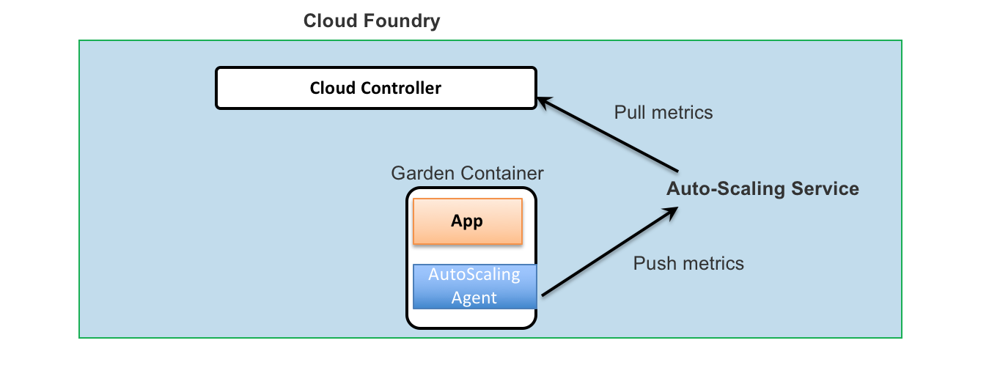

---

 

copyright:

  years: 2015，2018
lastupdated: "2017-08-09"  
 

---

{:codeblock: .codeblock}
{:shortdesc: .shortdesc}
{:new_window: target="_blank"}

# How metric values are calculated
{: #metric_calculation}

For dynamic scaling, an application is scaled against a selected runtime metric type . 
{{site.data.keyword.autoscaling}} service collects runtimes metrics through different data source.

For Liberty for Java, Node.js and Swift, {{site.data.keyword.autoscaling}} service replies on an embedded "{{site.data.keyword.autoscaling}} agent" which is injected into the application container to report its runtime metrics with "push" model.
For the other runtime types, {{site.data.keyword.autoscaling}} service pulls the metrics from cloud controller directly. 

The following figure shows how {{site.data.keyword.autoscaling}} collect metrics:
 

Given the different data collection approach in {{site.data.keyword.autoscaling}} service,  the supported metric for each runtime type is diverse.  
Also, even for the same metric type, i.e. memory, the value of the metric is calculated in different approach with various runtime type.

 {{site.data.keyword.autoscaling}} service calculates the metric values in the following ways: 
* "Memory" metric collected from Cloud Foundry: the value is the memory usage as percentage of memory limit of the application instance  
Cloud Foundry computes the memory usage from the "memory.stat" of cgroup with the formula below:  
`memory_usage = total_rss + total_cache - total_inactive_file`
   * total_cache:  memory used for page cache
   * total_rss:    memory resident in main memory (RAM)
   * total_inactive_file:  file-backed memory on inactive LRU list

* Metrics collected by Auto-Scaling data collector:  
  * "Memory" metric: the value is the memory usage as percentage of  memory limit of the application instance.  
  {{site.data.keyword.autoscaling}} data collector grabs  memory usage with the [rss](https://en.wikipedia.org/wiki/Resident_set_size) value in file */proc/{pid}/stat*:   
  `memory_usage = RSS (total memory actually held in RAM for a process)`
  * "Heap" metric: the value is the heap usage as percentage of the maximum heap size
  * "Response time" metric:  
     The value is the total elapsed time (in milliseconds) of all processed requests occurred in a time window (aka *report interval*) divided by the duration of the time window. 
  * "Throughput" metric:  
     The value is the average number of processed requests per second per application instance.

## Limitations
{: #limitations}

* For Java application using IBM Liberty buildpack,  {{site.data.keyword.autoscaling}} data collector uses [Liberty Monitor-1.0 feature -> ServletStats MXBean](https://www.ibm.com/support/knowledgecenter/SSEQTP_liberty/com.ibm.websphere.wlp.doc/ae/rwlp_mon_webapp.html) to collect the metrics. Pay attention to the following constraints  when Response time/Throughput metric is used for scaling.
   * Your application must be deployed as Liberty web application so that Liberty web container and Liberty Monitor-1.0 feature are loaded to collect the metrics. Spring Boot application deployed as a "Main-Classs" application or using embedded Tomcat server does not use Liberty web container, therefore no metrics data will be collected. 
   * The requests going to static HTML page are not captured by {{site.data.keyword.autoscaling}} data collector given no servlet is hit. For example, if you deploy the starter web-application of [Liberty for Java Runtime](https://console.bluemix.net/catalog/starters/liberty-for-java) and run load test against its root URL which is a static HTML page, the reported Response time/Throughput metric will be 0.   
* For Swift application, only Kitura framework is supported   
