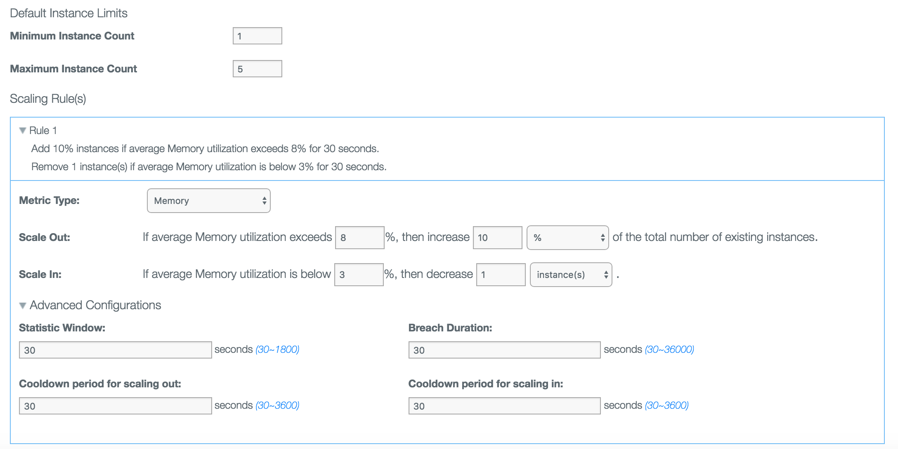
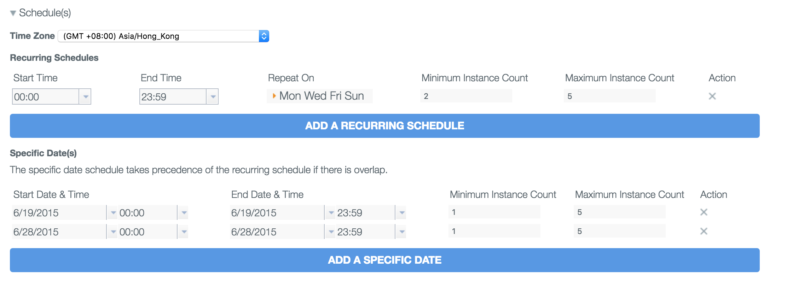

---

 

copyright:

  years: 2015，2018
lastupdated: "2017-08-09"  
 

---

{:codeblock: .codeblock}
{:shortdesc: .shortdesc}
{:new_window: target="_blank"}
{:deprecated: .deprecated}

# {{site.data.keyword.autoscaling}} policy definition
{: #policy_fields}

{{site.data.keyword.autoscaling}} is deprecated. As of 1 Augest 2019, you cannot provision new {{site.data.keyword.autoscaling}} instances on public region. Existing service instances are supported until 30 September 2019. To continue the auto-scaling capability for Cloud Foundray application in {{site.data.keyword.Bluemix_notm}}, please migrate to the NEW [built-in Auto-Scaling experience on Cloud Foundry application](https://{DomainName}/docs/cloud-foundry-public?topic=cloud-foundry-public-autoscale_cloud_foundry_apps). {:deprecated}

## Define Dynamic Scaling rule through Console
{: #dynamic_rule}

The following figure shows how to define Dynamic Scaling policy rule through Console:
 

| Field name  | Description |
|-------------|----------------------|
| *Minimum Instance Count* | The minimum number of the application instances that can be started. If the number of the instances equals this value, the {{site.data.keyword.autoscaling}} service won't scale in the application any more. |
| *Maximum instance count* | The maximum number of the application instances that can be started. If the number of the instances equals this value, the {{site.data.keyword.autoscaling}} service won't scale out the application any more. |
| *Metric Type* |   The supported metric types that can be monitored. For more information, see [Metric type supported for different runtimes](./metric.html). |
| *Scale Out* |   Specifies the threshold that triggers a scaling out action and how many instances or percentages of total instances will be added when the scaling out action is triggered.   You can choose to scale by % when you hope to scale out more quickly with a large instance basis. |
| *Scale In* |  Specifies the threshold that triggers a scaling in action and how many instances or percentages of total instances will be reduced when the scaling in action is triggered.   You can choose to scale by % when you hope to scale in more quickly with a large instance basis. |
| *Statistic Window* |  The length of the past period when received metric values are recognized as valid. Metric values are valid only if the time stamps fall within this period. The unit of the Statistic Window parameter is second. |
| *Breach Duration* | The length of the past period when a scaling action might be triggered. A scaling action is triggered when collected metric values are either above the upper threshold, or below the lower threshold longer than the time specified. The unit of the Breach Duration parameter is second. |
| *Cooldown period for scaling in* | After a scaling in action occurs, other scaling requests are ignored during the length of the period that is specified by the Cooldown period for scaling in parameter. The unit of this parameter is second. |
| *Cooldown period for scaling out* | After a scaling out action occurs, other scaling requests are ignored during the length of the period that is specified by the Cooldown period for scaling out parameter. The unit of this parameter is second. |

## Define Scheduled Scaling rule through Console
{: #schedule_rule}

The following figure shows how to define Scheduled Scaling policy rule through Console:
 

| Field name  | Description |
|-------------|----------------------|
| *Time Zone* | The time zone where the schedule applies. |
| *Start Time*  | The start time of a recurring schedule. |
| *End Time*    | The end time of a recurring schedule. |
| *Repeat On* | The days in a week when a recurring schedule applies. |
| *Start Date&Time* | The start date and time of the schedule is set up on a specific date. |
| *End Date&Time* | The end date and time of the schedule is set up on a specific date.  |
| *Minimum Instance Count* |  The minimum number of the application instances that applies in the defined schedule. |
| *Maximum instance count* | The maximum number of the application instances that applies in the defined schedule. |

*Note:* Each input field has its own allowed range.  {{site.data.keyword.autoscaling}} will validate the value and prompt related error message with invalid input.

## Policy definition through REST API and CLI.

When using REST API or CLI to define a {{site.data.keyword.autoscaling}} policy, a JSON file should be provided. Detailed field definition used in this JSON can be found in [Rest API of IBM {{site.data.keyword.autoscaling}} for {{site.data.keyword.Bluemix_notm}}](https://new-console.{DomainName}/apidocs/48)

<table>
  <tr>
    <td>**Field name**</td>
    <td>**Type**</td>
    <td>**Required**</td>
    <td>**Description**</td>
  </tr>
  <tr>
    <td align="left">**instanceMinCount**</td>
    <td>int</td>
    <td>required</td>
    <td>The minimum number of instances that can be started. If the number of the instances equals this value, the {{site.data.keyword.autoscaling}} service does not scale in the application any more. </td>
  </tr>
  <tr>
    <td align="left">**instanceMaxCount**</td>
    <td>int</td>
    <td>required</td>
    <td>The maximum number of the application instance that can be started. If the current number of the application instances equals this value, the {{site.data.keyword.autoscaling}} service does not scale out the application any more.</td>
  </tr>
  <tr>
    <td align="left">**policyTriggers** </td>
    <td>array</td>
    <td>required</td>
    <td>Array of settings of Dynamic Scaling policy rule  that will trigger scaling action in this policy</td>
  <tr>
  <tr>
    <td align="right">**metricType**</td>
    <td>string</td>
    <td>required</td>
    <td>The supported metric types that can be monitored. For more information, see [Metric type supported for different runtimes](./metric.html).</td>
  </tr>
  <tr>
    <td align="right">**statWindow**</td>
    <td>int</td>
    <td>optional</td>
    <td>The length of the past period when received metric values are recognized as valid. Metric values are valid only if the time stamps fall within this period. The unit of the Statistic Window parameter is second. Default value is **300** seconds</td>
  </tr>
  <tr>
    <td align="right">**breachDuration**</td>
    <td>int</td>
    <td>optional</td>
    <td>The length of the past period when a scaling action might be triggered. A scaling action is triggered when collected metric values are either above the upper threshold, or below the lower threshold longer than the time specified. The unit of the Breach Duration parameter is second. Default value is **600** seconds</td>
  </tr>
  <tr>
    <td align="right">**lowerThreshold**</td>
    <td>int</td>
    <td>optional</td>
    <td>low threshold percentage that will trigger a scaling event usually scaling in. Default value is **30** percent</td>
  </tr>
  <tr>
    <td align="right">**upperThreshold**</td>
    <td>int</td>
    <td>optional</td>
    <td>upper threshold percentage that will trigger a scaling event usually scaling out. Default value is **80** percent</td>
  </tr>
  <tr>
    <td align="right">**instanceStepCountDown**</td>
    <td>int</td>
    <td>optional</td>
    <td>number/percentage of instance to reduce per scaling in action. Default value is **1 instance** </td>
  </tr>
  <tr>
    <td align="right">**instanceStepCountUp**</td>
    <td>int</td>
    <td>optional</td>
    <td>number/percentage of instance to increase per scaling out action Default value is **1 instance**</td>
  </tr>
  <tr>
    <td align="right">**stepDownCoolDownSecs**</td>
    <td>int</td>
    <td>optional</td>
    <td>After a scaling in action occurs, other scaling requests are ignored during the length of the period that is specified by the Cooldown period for scaling in parameter. The unit of this parameter is second. Default value is **600** seconds</td>
  </tr>
  <tr>
    <td align="right">**stepUpCoolDownSecs**</td>
    <td>int</td>
    <td>optional</td>
    <td>After a scaling out action occurs, other scaling requests are ignored during the length of the period that is specified by the Cooldown period for scaling out parameter. The unit of this parameter is second. Default value is **600** second</td>
  </tr>
  <tr>
    <td align="right">**scaleInAdjustmentType**</td>
    <td>string</td>
    <td>optional</td>
    <td>instance change type (**changeCapacity**/**changePercentage**) during scaling in, if its value is **changeCapacity**, the unit of  **instanceStepCountDown** is number of instance, if its value is **changePercentage**, the unit of  **instanceStepCountDown** is percentage of current instance. Default value is **changeCapacity**</td>
  </tr>
  <tr>
    <td align="right">**scaleOutAdjustmentType**</td>
    <td>string</td>
    <td>optional</td>
    <td>instance change type (**changeCapacity**/**changePercentage**) during scaling out, if its value is **changeCapacity**, the unit of  **instanceStepCountUp** is number of instance, if its value is **changePercentage**, the unit of  **instanceStepCountUp** is percentage of current instance. Default value is **changeCapacity**</td>
  </tr>
  <tr>
    <td align="left">**schedules**</td>
    <td>object</td>
    <td>optional</td>
    <td>Scheduled Scaling rule definition</td>
  </tr>
  <tr>
    <td align="center">**timezone**</td>
    <td>string</td>
    <td>required</td>
    <td>Time zone setting of this Scheduled Scaling rule</td>
  </tr>
  <tr>
    <td align="center">**recurringSchedule**</td>
    <td>array</td>
    <td>optional</td>
    <td>Array of Scheduled scaling setting that set instance count in recurring mode</td>
  </tr>
  <tr>
    <td align="right">**startTime**</td>
    <td>string</td>
    <td>required</td>
    <td>start time of day of this rule in format of HH:mm</td>
  </tr>
  <tr>
    <td align="right">**endTime**</td>
    <td>string</td>
    <td>required</td>
    <td>end time of day of this rule in format of HH:mm</td>
  </tr>
  <tr>
    <td align="right">**maxInstCount**</td>
    <td>int</td>
    <td>required</td>
    <td>maximum instance count in this rule</td>
  </tr>
  <tr>
    <td align="right">**minInstCount**</td>
    <td>int</td>
    <td>required</td>
    <td>minimum instance count in this rule</td>
  </tr>
  <tr>
    <td align="right">**repeatOn**</td>
    <td>string</td>
    <td>required</td>
    <td>weekday list in which this scaling rule take effect, like "[\"1\",\"2\",\"3\",\"4\",\"5\",\"6\",\"7\"]"</td>
  </tr>
  <tr>
    <td align="center">**specificDate**</td>
    <td>array</td>
    <td>optional</td>
    <td>Array of Scheduled scaling setting that set instance count in specfic date</td>
  </tr>
  <tr>
    <td align="right">**startDate**</td>
    <td>string</td>
    <td>required</td>
    <td>start date for this rule to take effect in format of YYYY-MM-DD</td>
  </tr>
  <tr>
    <td align="right">**startTime**</td>
    <td>string</td>
    <td>required</td>
    <td>start time of day in format of HH:mm in this rule</td>
  </tr>
  <tr>
    <td align="right">**endDate**</td>
    <td>string</td>
    <td>required</td>
    <td>end date for this rule to take effect in format of YYYY-MM-DD</td>
  </tr>
  <tr>
    <td align="right">**endTime**</td>
    <td>string</td>
    <td>required</td>
    <td>end time of day in format of HH:mm in this rule</td>
  </tr>
  <tr>
    <td align="right">**maxInstCount**</td>
    <td>int</td>
    <td>required</td>
    <td>maximum instance count in this rule</td>
  </tr>
  <tr>
    <td align="right">**minInstCount**</td>
    <td>int</td>
    <td>required</td>
    <td>minimum instance count in this rulee</td>
  </tr>
</table>

Sample of JSON file can be found in [Sample policy file for {{site.data.keyword.Bluemix_notm}} {{site.data.keyword.autoscaling}} service](./reference/sample.html)

*Note:* Each input field has its own allowed range.  {{site.data.keyword.autoscaling}} will validate the value and prompt related error message with invalid input.
